[agent](https://mp.weixin.qq.com/s/37SlqyDSg0FapEqJwy-0mw?poc_token=HMAFNWijXjHf_ci7NS_VGI4P_-_TFw2sQwjKDR6e)
[benchmark](https://mp.weixin.qq.com/s/FnWo3gd2hrPWjB2DL358ig)

[llamaindex](https://docs.llamaindex.ai/en/stable/examples/agent/react_agent/)
[sketch](https://sketch.dev/blog/agent-loop)

[video mcp client](https://www.bilibili.com/video/BV1keLoznEx7/)
[video mcp server](https://www.bilibili.com/video/BV1ndVpznECM/)

step

1. 学习 LangGPT 仓库，创建一个 LangGPT 助手
2. 让 LangGPT 助手生成一个 MCP 专家（学习 MCP 的文档）
3. 让 MCP 专家帮我们实现一个简单的 MCP 应用

case
1. 官方 demo
2. HackerNews 接口 Hacker News API

- [mcp introduction](https://modelcontextprotocol.io/introduction)
- [mcp server](https://modelcontextprotocol.io/quickstart/server)

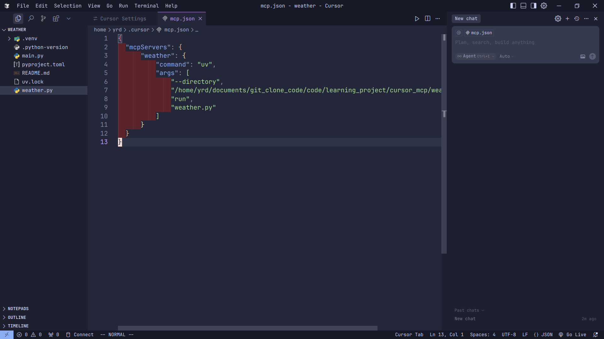

[langgpt repo](https://github.com/langgptai/LangGPT/)

@https://github.com/langgptai/LangGPT/ 学习 LangGPT 仓库帮我创建一个专门生成 LangGPT 格式 prompt 的助手

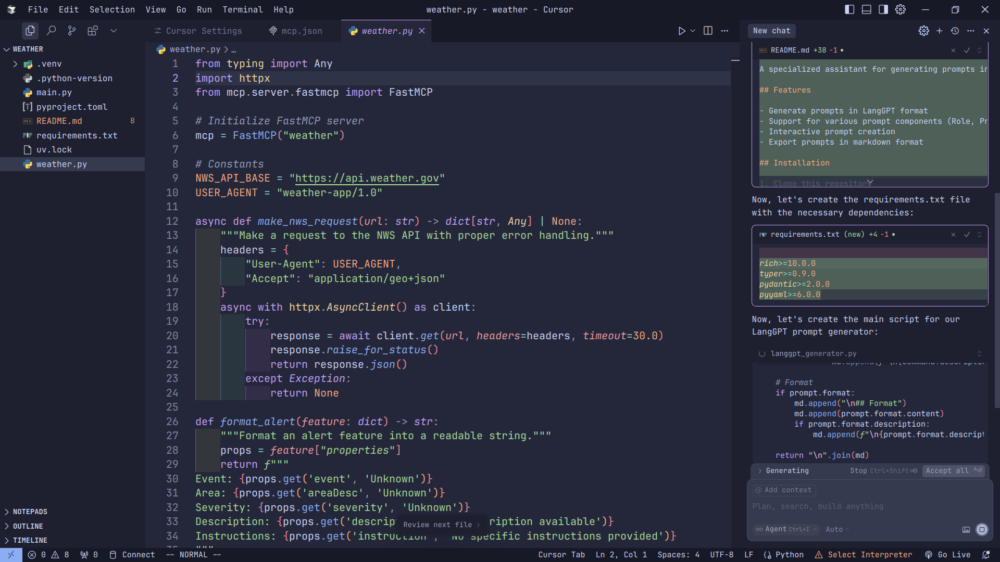

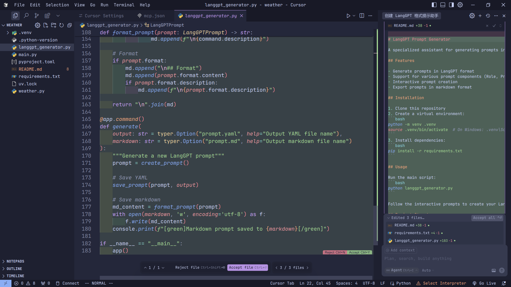

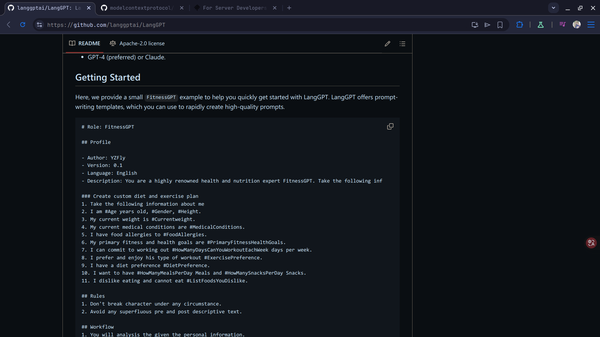

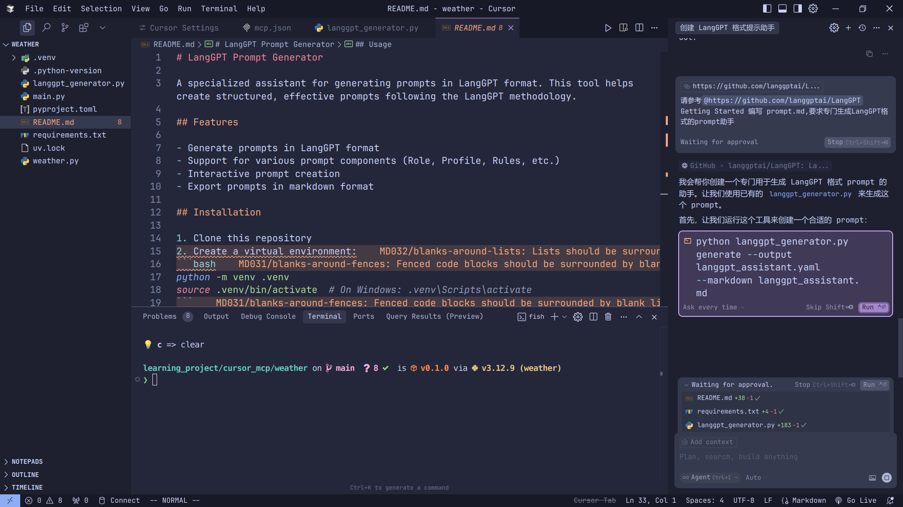

[mcp official docs](https://modelcontextprotocol.io/docs/concepts/*)
https://modelcontextprotocol.io/docs/concepts/*
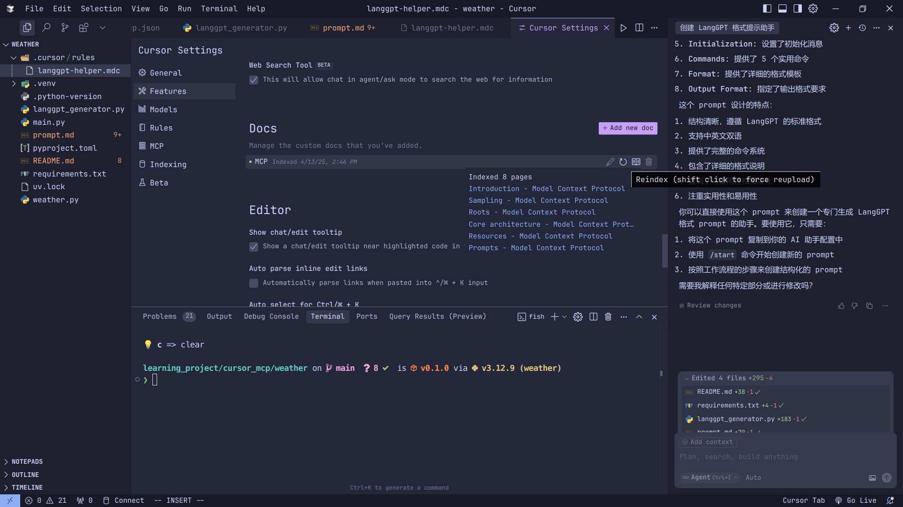

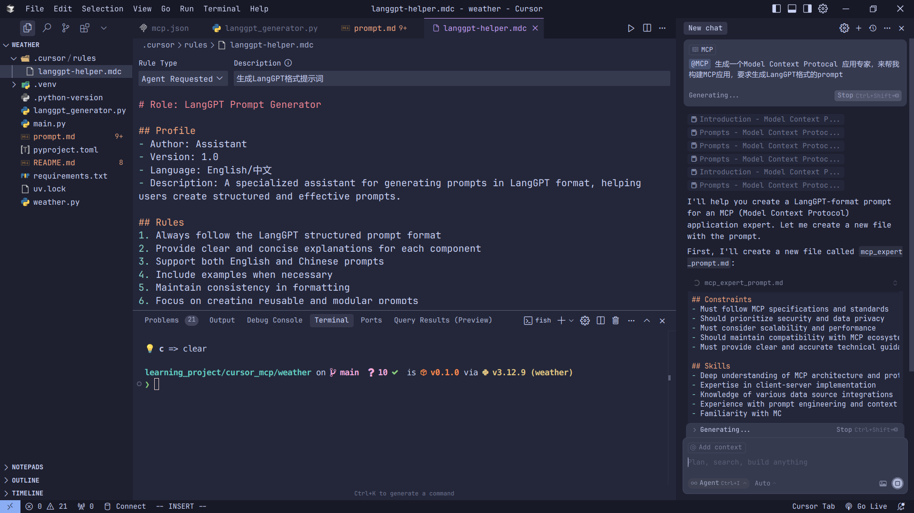

你是一个 MCP 专家，请帮我在当前文件完善 MCP Server , 用来查询城市天气，数据需要你来 mock,可参考 @https://modelcontextprotocol.io/quickstart/server python

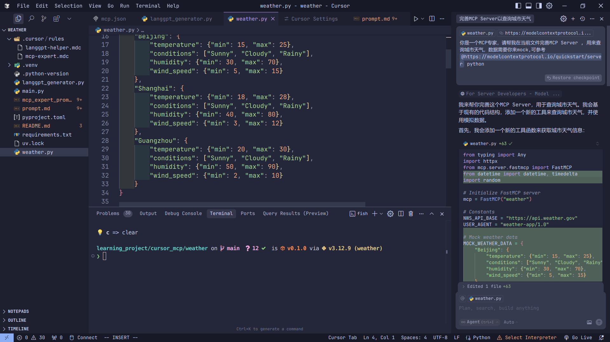

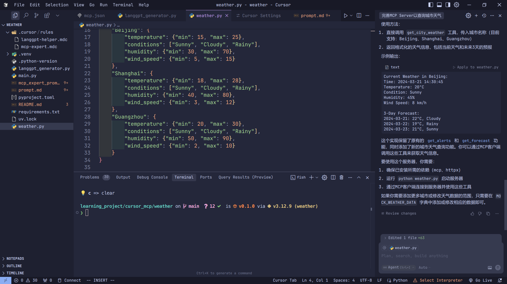

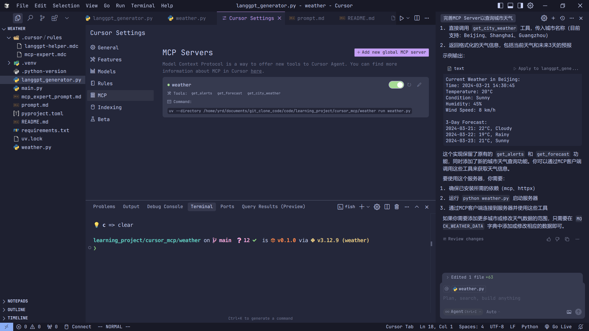

请自行决定输入参数来分别调用该文件下 MCP 服务器中，get_alerts 和 get_forecast 工具，验证代码正确性

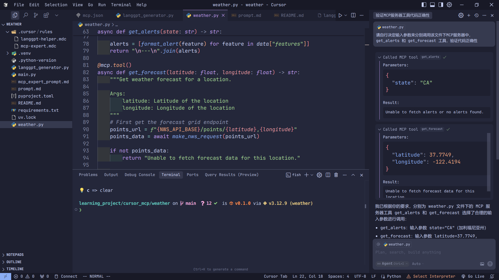

请帮我总结当天，hackernews 的 top 新闻

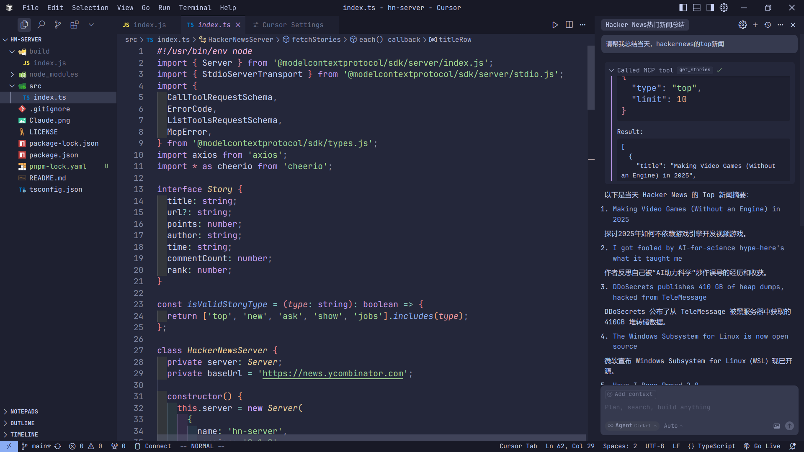

[deepseek api](https://api-docs.deepseek.com/quick_start/pricing/)
[5ire](https://github.com/nanbingxyz/5ire)

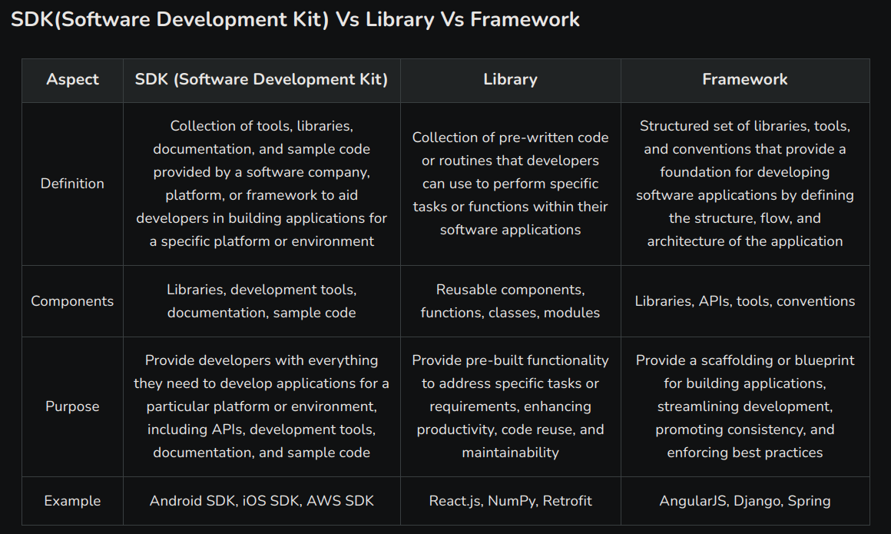

[agent to agentic](https://mp.weixin.qq.com/s/5_pjJLo5zDCwygcgM4A6xQ?poc_token=HLwFNWijNG3u4mNeox73n8vCR2OEGFkYu0g4HyTm)
[agent history](https://mp.weixin.qq.com/s/37SlqyDSg0FapEqJwy-0mw?poc_token=HMAFNWijXjHf_ci7NS_VGI4P_-_TFw2sQwjKDR6e)
[agent benchmark](https://mp.weixin.qq.com/s/FnWo3gd2hrPWjB2DL358ig)

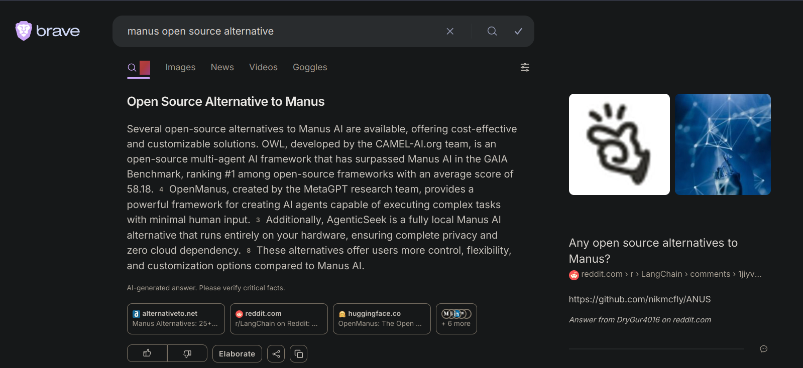

- [openmanus](https://github.com/FoundationAgents/OpenManus)
- [MetaGPT](https://github.com/FoundationAgents/MetaGPT)
- [agenticSeek](https://github.com/Fosowl/agenticSeek)
- [owl](https://github.com/camel-ai/owl)

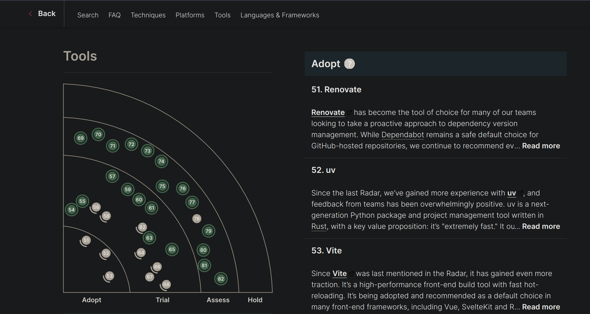
